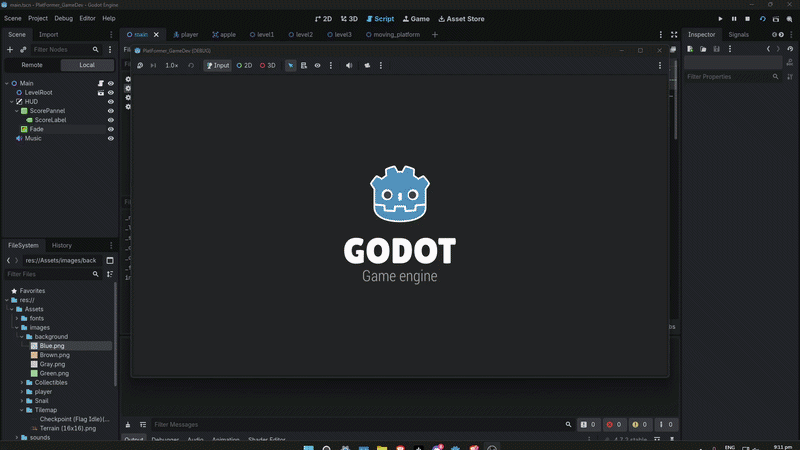
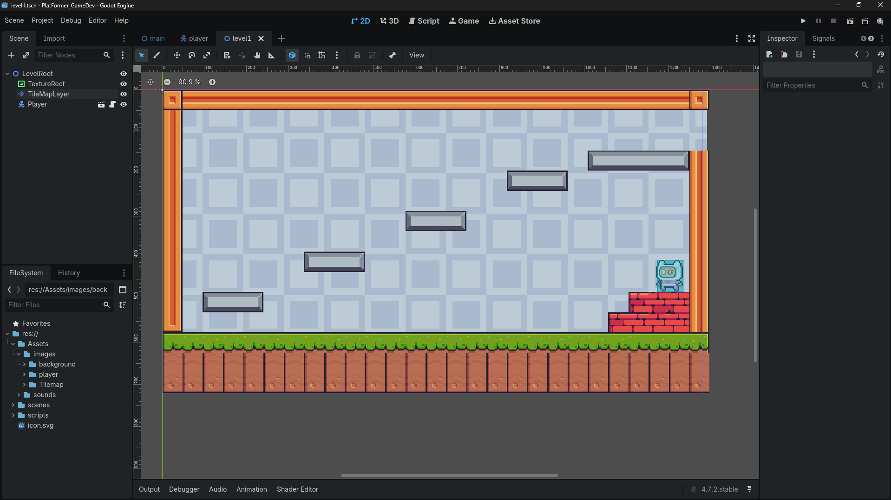
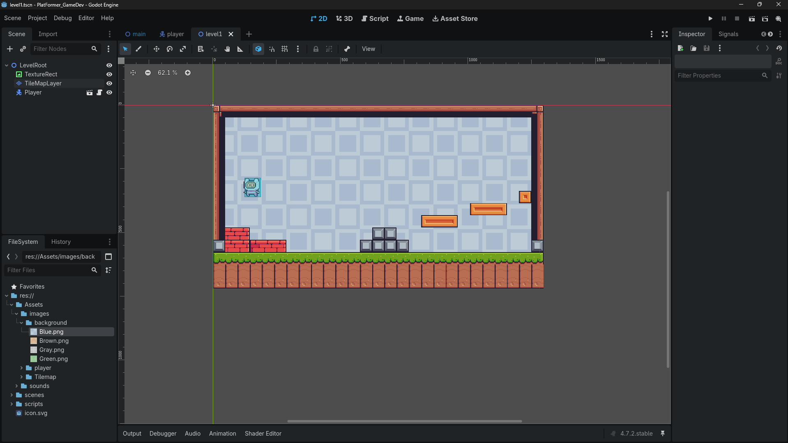
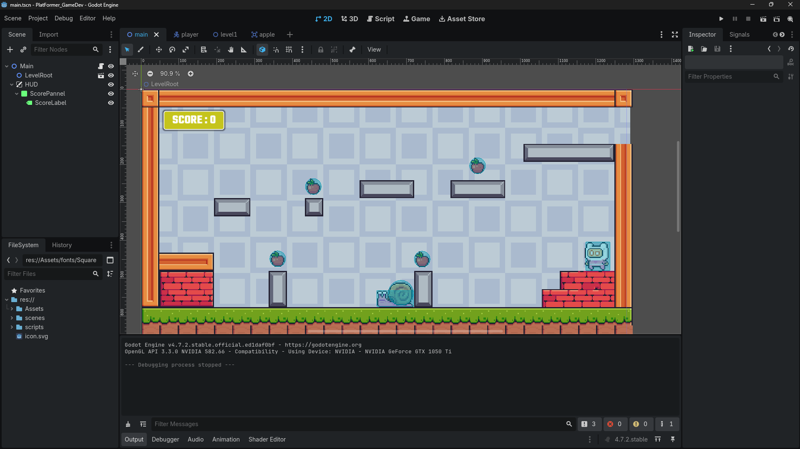
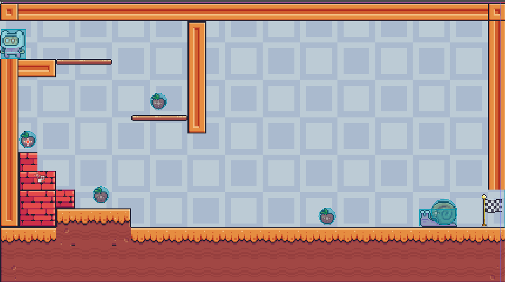
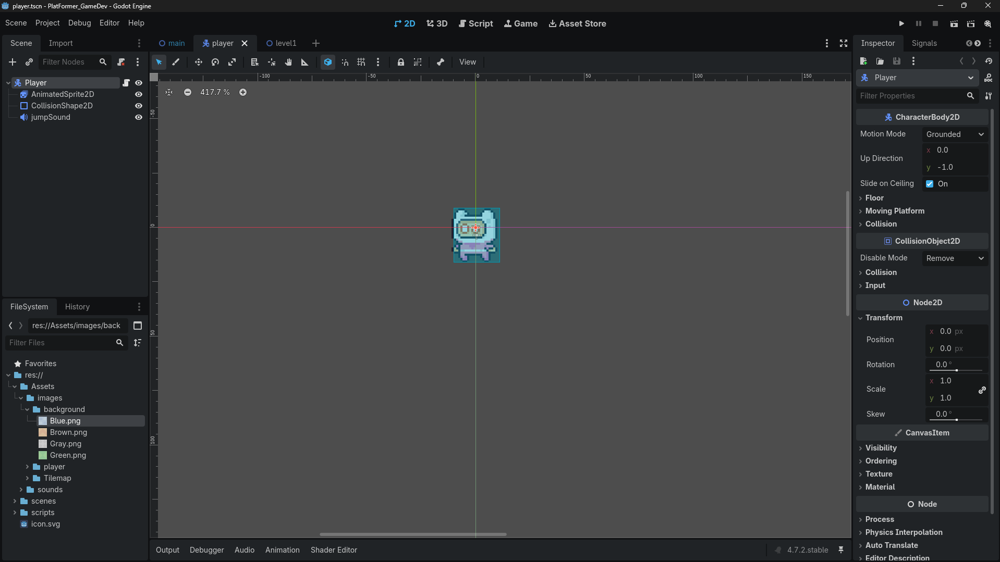
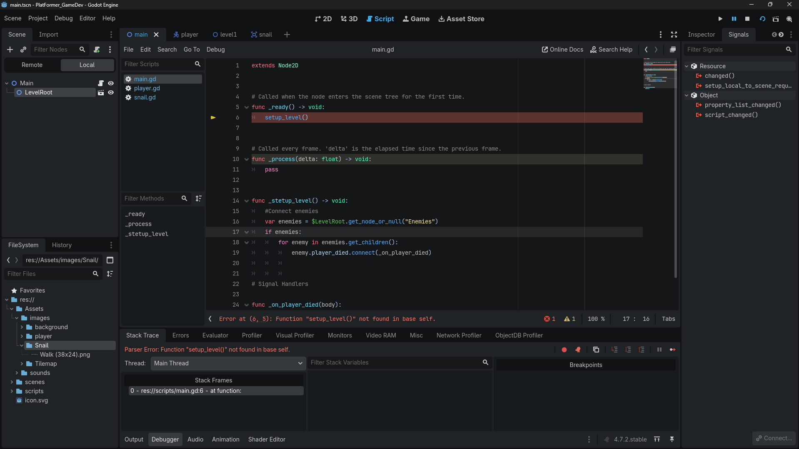
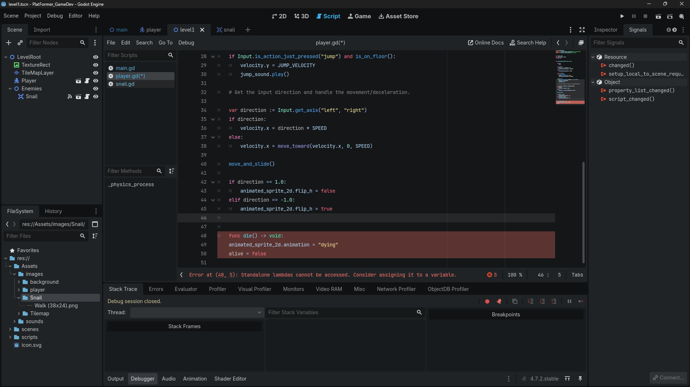
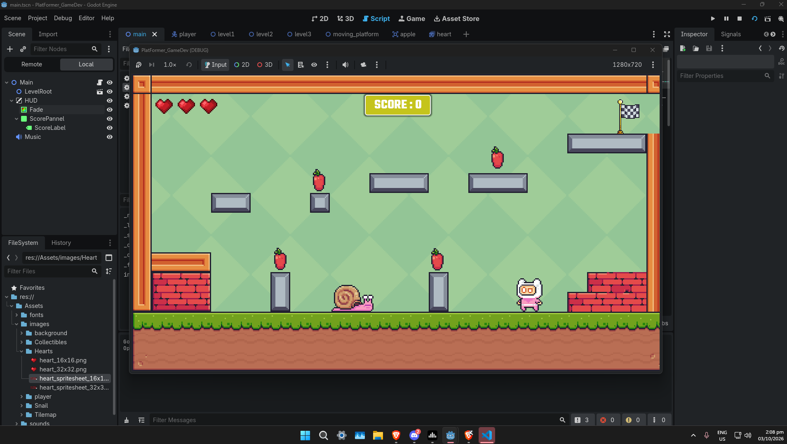
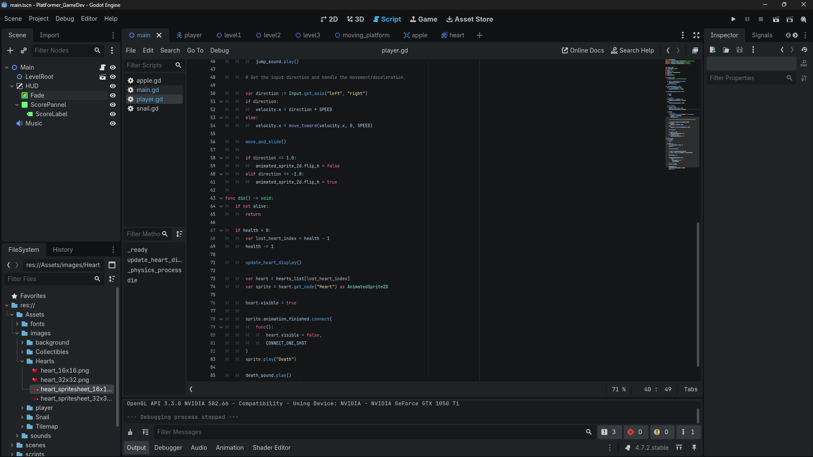

# 2D Platformer

## CS-5105N Game Development

### Weekly Activities — Godot Game Development

## 1. Introduction

This project focuses on developing a 2D platformer game using the Godot game engine. The project was developed through weekly activities covering project setup, gameplay mechanics, level design, animation, particles, user interface, and audio.

The game is designed to let the player move through platform-based levels, avoid enemies, and collect items.

## 2. Game Concept

**Game Title:** 2D Platformer

**Genre:** 2D Platformer

**Game Engine:** Godot 4

The game is a 2D platformer where the player navigates through levels by moving and jumping across platforms. The player can collect apples and encounter enemies while progressing through the game.

The project is being developed incrementally, with each weekly activity introducing new gameplay features and improvements.

## 3. Godot Project Setup

The project was created using Godot 4. The project contains separate folders for assets, scenes, and scripts to organize the game's resources and functionality.

### Project Files

The project includes the following folders and files:

- `Assets` — Game assets and resources.
- `scenes` — Game levels and reusable scenes.
- `scripts` — Scripts that control gameplay and game logic.
- `.gitignore` — Excludes unnecessary generated files.
- `.gitattributes` — Configures Git attributes and Git LFS tracking.
- `project.godot` — Main Godot project configuration.

## 4. Week 1 — Godot & Git Setup

### Objective

This activity focused on setting up the Godot development environment, creating the project structure, and configuring Git and GitHub for version control.

### Project Setup

A new Godot 4 project was created for the 2D platformer. The project was organized into folders for scenes, scripts, and assets.

### Git and GitHub Setup

Git was initialized in the project directory and connected to a personal GitHub repository.

A `.gitignore` file was added to exclude generated Godot files, while `.gitattributes` was used to configure Git LFS for large assets.

The project was committed and pushed to GitHub to maintain a history of development.

## 5. Week 2 — Gameplay Mechanics & Game Feel

### Objective

This activity focused on implementing the player's movement and jumping mechanics and making the controls responsive during gameplay.

### Player Mechanics

A `CharacterBody2D` was used to create the player character. A script was added to handle horizontal movement, jumping, and gravity.

### Player Controls

| Key | Action |
|---|---|
| A / Left Arrow | Move Left |
| D / Right Arrow | Move Right |
| Space | Jump |

### Collision and Interaction

Collision detection was implemented to allow the player to interact with platforms and other game objects.

### Game Feel

Player animations and sound effects provide feedback during gameplay. Additional visual effects are used to make interactions more noticeable.

## 6. Week 3 — Level Design

### Objective

This activity focused on creating two playable levels, adding obstacles and enemies, and introducing a gradual increase in difficulty.

### Level 1

Level 1 introduces the player to the basic platforming mechanics, including movement and jumping. Platforms, obstacles, and a level exit provide the player with a path through the level.

### Level 2

Level 2 builds on the first level by introducing additional challenges, including enemies and collectible apples.

### Level Transition

A level transition system was implemented to allow the player to proceed to the next level after reaching the exit.

### Difficulty Progression

Level 1 introduces the basic controls and platforming mechanics. Level 2 expands on these mechanics by adding more challenges and collectibles.

### Level 3 — Planned

Level 3 is planned as an additional level to expand the game. It is intended to build on the existing gameplay and level progression.

## 7. Week 4 — Art, Animation & Particles

### Objective

This activity focused on improving the game's visual presentation through character animations and particle effects.

### Player Animations

The player character uses `AnimatedSprite2D` to display different animations based on the player's state.

The animations include:

- Idle
- Running
- Jumping
- Dying

The player's script changes the animation according to movement and gameplay events.

### Particle Effects

A particle effect is used when the player collects an apple, providing visual feedback for the pickup.

### Visual Improvements

Animations and particle effects make the player's actions and interactions easier to recognize during gameplay.

## 8. Week 5 — UI/UX & Audio

### Objective

This activity focuses on adding a user interface, background music, sound effects, and accessibility improvements.

### Heads-Up Display (HUD)

A `CanvasLayer` was used to display the game's HUD. A score label displays the player's score and updates when apples are collected.

### Sound Effects

Sound effects were added to provide audio feedback for gameplay actions, including jumping and other interactions.

### Background Music

Background music was added to the game and configured to play automatically during gameplay.

### Audio Buses

Separate audio buses for music and sound effects are planned to allow their volumes to be controlled independently.

### Main Menu and Accessibility

The main menu, restart options, and an accessibility feature are still being developed.

### Playtesting

A peer playtest and a documented improvement based on player feedback are still pending.

## 9. Current Development Status

The project currently includes player movement, jumping, enemies, collectible apples, level transitions, player animations, particle effects, a score HUD, a three-heart health system, sound effects, and background music.

The heart health system displays three hearts on the HUD and removes a heart when the player is hit by an enemy. Health is maintained when the player respawns.

Level 1 and Level 2 have been created. Level 3 is planned as a future addition.

Some Week 5 features, including the main menu, separate audio buses, accessibility improvements, and peer playtesting, remain to be completed.

## 10. Tools and Technologies

- Godot 4 — Game engine
- GDScript — Gameplay programming
- Git — Version control
- GitHub — Project repository

## 11. Conclusion

The project has progressed from a basic Godot setup to a platformer with movement, collectibles, enemies, multiple levels, animations, visual effects, and audio.

Further development will focus on completing the user interface, improving accessibility, refining audio controls, and expanding the game with additional levels.

## 12. Gameplay Demonstration & Development Evidence

This section contains screenshots, GIFs, and video recordings documenting the development and gameplay of the platformer project.

### Gameplay Recordings

The following recordings demonstrate the current gameplay and level progression.

**Full Gameplay Recording**

[Watch the full gameplay recording](snippets/fullrun.mp4)

**Gameplay Through Multiple Levels**

[Watch the gameplay recording with music](snippets/playthroughwmusic.mp4)

### Player Animation

The following GIF demonstrates the player's dying animation.

### Level Design

The following screenshots document the creation and design of the game's levels.

**Creating the Maps**

**Level 1 Development**

**Completed Level 1**

**Level 2 Development**

### Player and Scripting

The following screenshots document the player model and scripting work.

**Player Model**

**Scripting**

### Player Health and Heart System

A three-heart health system was added to the player HUD to provide visual feedback about the player's remaining health.

Each heart represents one health point. When the player is hit by an enemy, one health point is removed and the corresponding heart is hidden from the HUD. The player's remaining health is maintained when the player respawns at the level's spawn point.

The heart icons also use animations when their health state changes. The game uses fade-out and fade-in transitions when the level is reloaded, allowing the heart animations and health state to update together.

**Heart Health System**

**Heart Health Scripting**

**Heart Animation and Fade Transition Demonstration**

[Watch the heart animation and fade transition demonstration](snippets/HeartsUpdate.mp4)